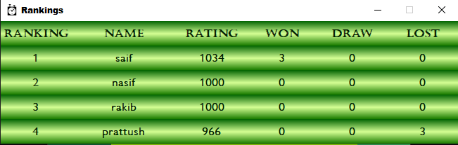

# Chess Clock App

This is a chess clock application developed using PyQt6. The application offers features for managing chess matches, including creating profiles, displaying profiles, viewing match history, and checking rankings. It is integrated with a MySQL database to store player information and match data.

## Features
- **Profile Management**: Create and display player profiles with relevant details.
- **Match History**: View match history and performance statistics.
- **Ranking**: Check player rankings based on performance.
- **Game Setup**: Choose the game type and enter players' names before starting a match.
- **Match Timer**: Timer starts when players confirm names and game type.
- **Game Controls**: Buttons for actions such as declaring checkmate, draw, or resignation.
- **Winner Declaration**: Another window pops up after match ends to declare the winner.

## Requirements
- Python 3.x
- PyQt6 library
- MySQL server

## Installation
1. Clone the repository:

    ```bash
    git clone https://github.com/your_username/chess-clock-app.git
    ```

2. Install dependencies:

    ```bash
    pip install PyQt6 mysql-connector-python
    ```

## Usage
1. Navigate to the project directory.

2. Run the main Python script:

    ```bash
    python main.py
    ```

3. In the main window, click on buttons to create profile, view stats, or check rankings. Choose game type and enter player names to start a match.

4. Timer starts when players confirm names and game type. Use buttons for game controls during the match.

5. After match ends, a winner declaration window appears.

## Screenshots





## Acknowledgments
- This chess clock application is inspired by PyQt6 tutorials and utilizes MySQL database integration.
- Special thanks to PyQt6 developers and MySQL maintainers for their contributions.

## License
This project is licensed under the MIT License. See the [LICENSE](LICENSE) file for details.

## Author
- Nasiful Alam

## Contributions
Contributions are welcome! Feel free to submit bug reports, feature requests, or pull requests to enhance the chess clock application.
